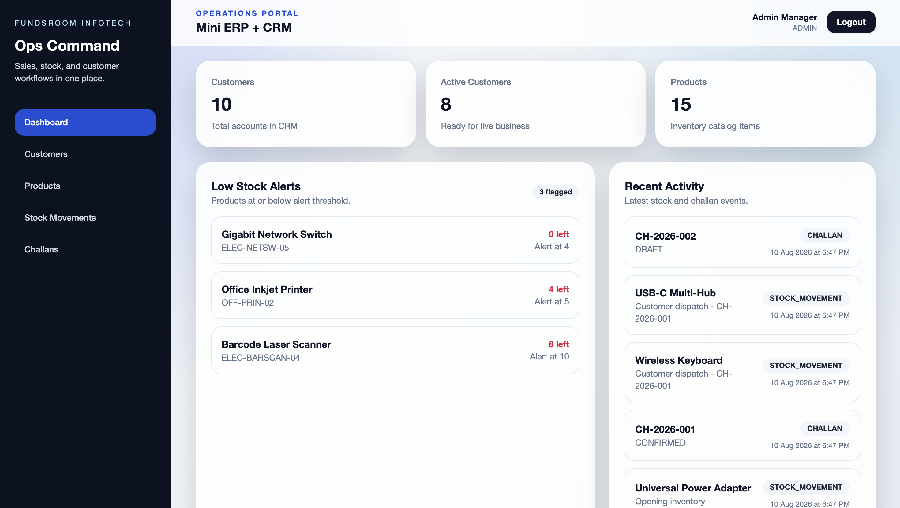

# Mini ERP + CRM Operations Portal

A production-style ERP + CRM operations platform built for Fundsroom Infotech to manage customers, products, inventory, stock movements, sales challans, and role-based operations.


---

## 🚀 Live Demo

**[🌐 Open Live Application](https://fundsroom-infotech-client.vercel.app/)**

**[⚙️ Open Backend API](https://fundsroom-api-u6tm.onrender.com)**

---

## 📚 Documentation

The complete project documentation covers:

- Requirements
- SDLC
- System Design
- Architecture
- Authentication & RBAC
- Database Design
- Backend API
- Frontend
- Features
- Testing
- Deployment
- User Guide
- Screenshots
- Limitations & Future Scope

**[📖 Open Complete Documentation →](https://rahul-pamula.github.io/fundsroom_infotech/)**

---

## 🖥️ Application Preview

<table>
<tr>
<td width="50%">


<p align="center"><b>Landing Page</b></p>

</td>

<td width="50%">



<p align="center"><b>Dashboard</b></p>

</td>
</tr>

<tr>
<td width="50%">


<p align="center"><b>Customer CRM</b></p>

</td>

<td width="50%">


<p align="center"><b>Products & Inventory</b></p>

</td>
</tr>
</table>

---

## 📌 Overview

The Mini ERP + CRM Operations Portal is a full-stack business operations system designed for wholesale and distribution workflows.

It brings together:

- Customer CRM
- Products
- Inventory
- Stock movements
- Sales challans
- Follow-ups
- Authentication
- Role-based access control

---

## 🎯 Problem

The system is designed for a wholesale/distribution business where Sales, Warehouse, Accounts, and Admin users need shared operational data while maintaining role-specific access.

The case study specifically requires authentication, CRM, inventory, stock movement, and sales challan workflows.

---

## 💡 Solution

The portal provides one centralized system for:

- Customer management
- Product management
- Inventory tracking
- Stock movement auditing
- Sales challans
- CRM follow-ups
- Role-based access

---

## ✨ Key Features

| Module | Highlights |
|---|---|
| 🔐 Authentication | JWT authentication + RBAC |
| 👥 Customer CRM | Add, edit, search, details, follow-ups |
| 📦 Products | SKU, category, pricing, stock |
| 📊 Inventory | IN/OUT movements and low-stock visibility |
| 🧾 Challans | Draft, confirm, cancel, multiple products |
| 📈 Dashboard | Operational summaries and recent activity |

---

## 🛡️ Role-Based Access

| Role | Purpose |
|---|---|
| ADMIN | Full operational control |
| SALES | Customer and sales workflows |
| WAREHOUSE | Inventory and stock operations |
| ACCOUNTS | Customer, product and challan operations |

**Role authorization is enforced server-side; the login role selection is only verified against the user's actual database role.**

[View Authentication & RBAC Documentation →](https://rahul-pamula.github.io/fundsroom_infotech/)

---

## 🏗️ Architecture

```text
User
 │
 ▼
React Frontend
(Vercel)
 │
 │ HTTPS / REST API
 ▼
Express Backend
(Render)
 │
 │ pg
 ▼
Supabase PostgreSQL
```

---

## 💻 Setup & Deployment

Detailed instructions for local setup, Docker configuration, demo credentials, deployment instructions, and project limitations are fully documented on the project website.

**[📖 View Full Setup Instructions in Documentation →](https://rahul-pamula.github.io/fundsroom_infotech/)**
