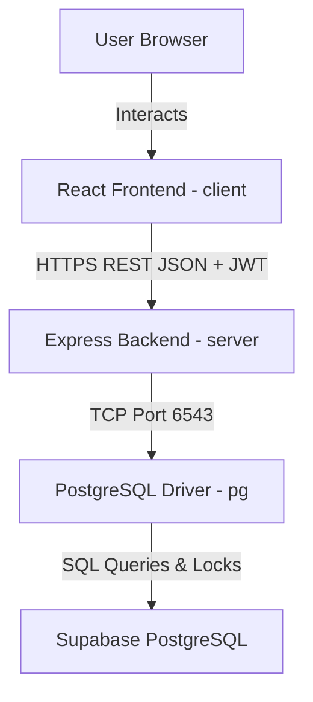
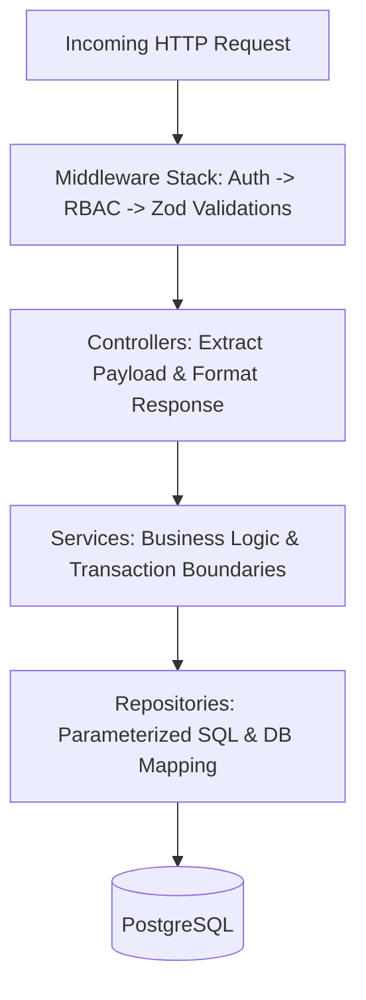

# 7. Architecture

The system communicates unidirectionally via HTTP and TCP protocols.

## High-Level Architecture Flow

## Backend Layered Architecture (Clean Architecture)

The Node.js Express backend strictly isolates responsibilities passing from the HTTP layer down to the database level:

