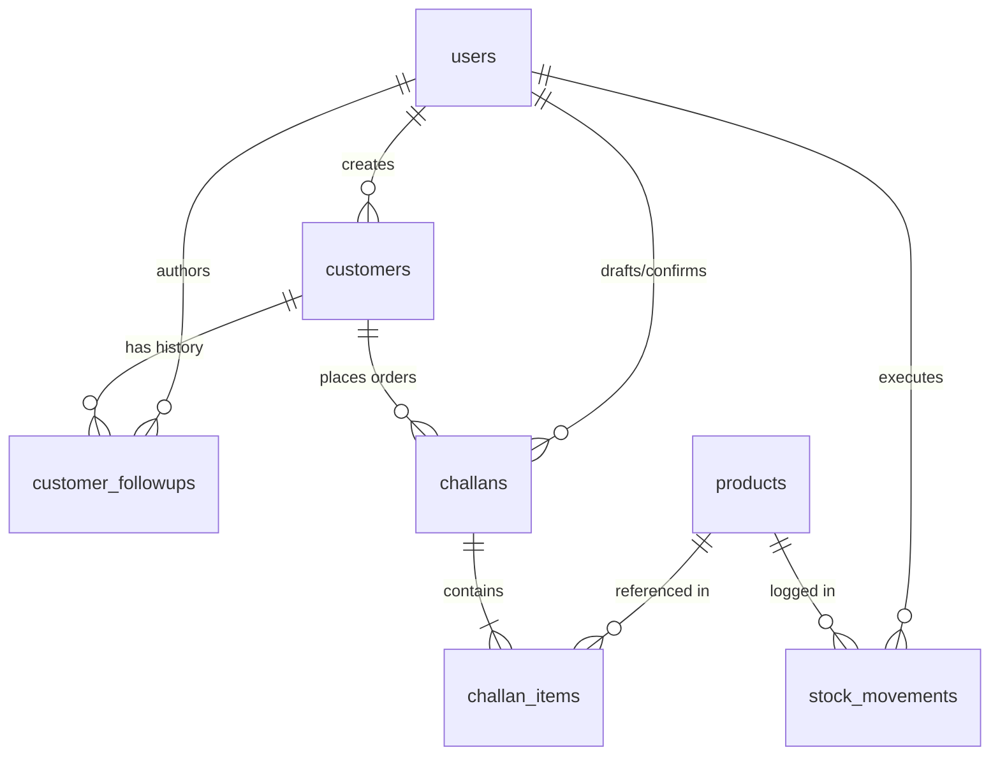

# 10. Database Architecture

The backend connects directly to a managed Supabase PostgreSQL instance via the `pg` driver.

## Schema Overview (3NF)

The database is normalized to Third Normal Form (3NF). Primary keys utilize `UUIDv4` via `gen_random_uuid()`.

1. **`users`**: Stores login credentials, hashes, and RBAC roles.
2. **`customers`**: CRM profiles containing contact info and lifecycle status (`LEAD`, `ACTIVE`, `INACTIVE`).
3. **`customer_followups`**: Auditable text logs mapped to specific customers and users.
4. **`products`**: The master catalog tracking names, SKUs, and `current_stock`.
5. **`stock_movements`**: Immutable ledger tracking every stock change (IN/OUT), quantities, and business reason.
6. **`challans`**: Sales order header records tracking `total_quantity` and status (`DRAFT`, `CONFIRMED`, `CANCELLED`).
7. **`challan_items`**: Sales order line items containing **immutable snapshots** (`snapshot_product_name`, `snapshot_sku`, `snapshot_unit_price`) protecting historical invoices from master catalog modifications.

## ER Diagram

## Indexing
Indexes are applied to foreign key columns, unique lookups (`sku`, `challan_number`), and frequent filters (`customer status`, `mobile`).
